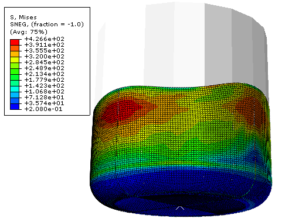

#  PolyN

A general modeling framework for plane stress symmetric yield functions based on homogeneous polynomials of arbitrary order and capable of handling arbitrary input data 
(from the traditional characterization of sheet metal based on mechanical testing to arbitrary sets of virtual experiments).

Code:

- Python scripts for yield surface modeling 
- Abaqus-python scripts for simulation setups
- Constitutive subroutines - UMAT

Basic usage is described in: zetc/PolyN_Usage.pdf

##  License

MIT

